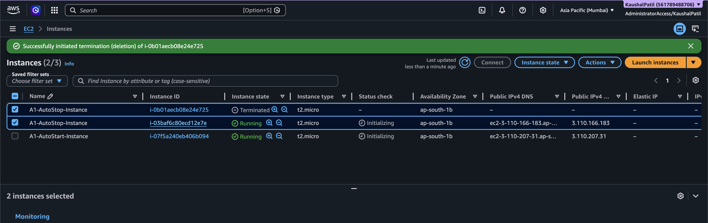
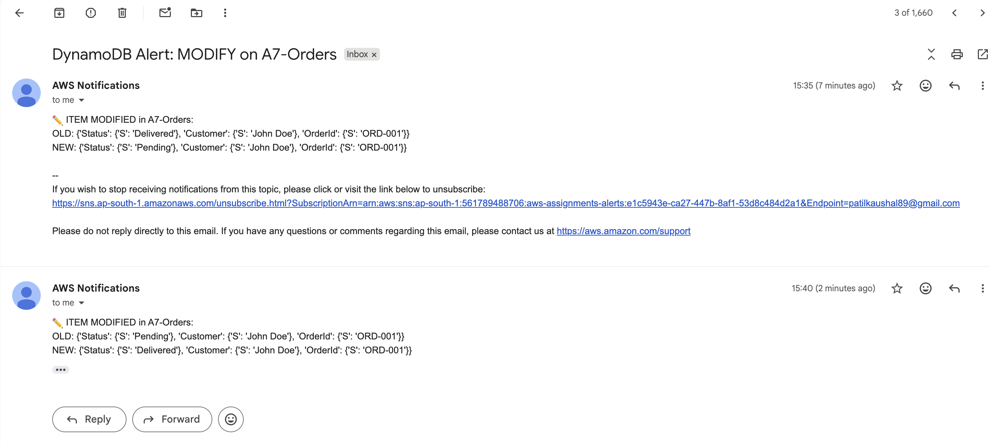
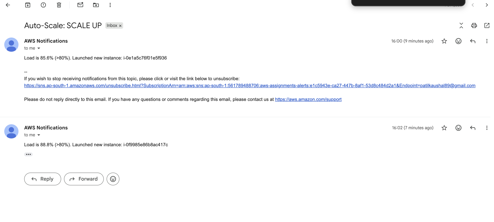
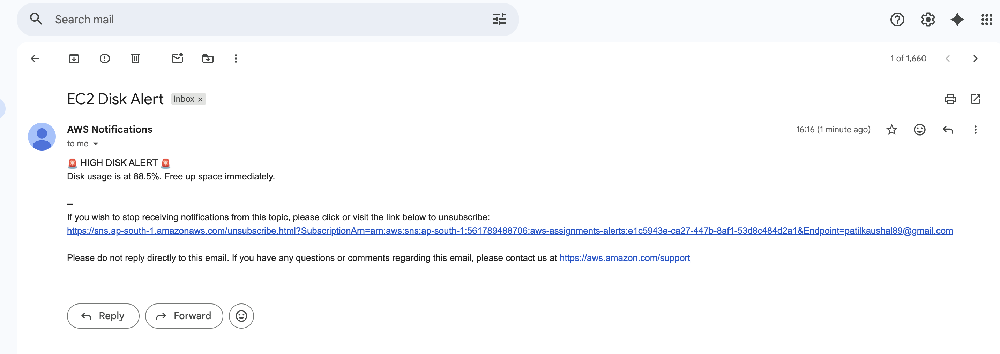
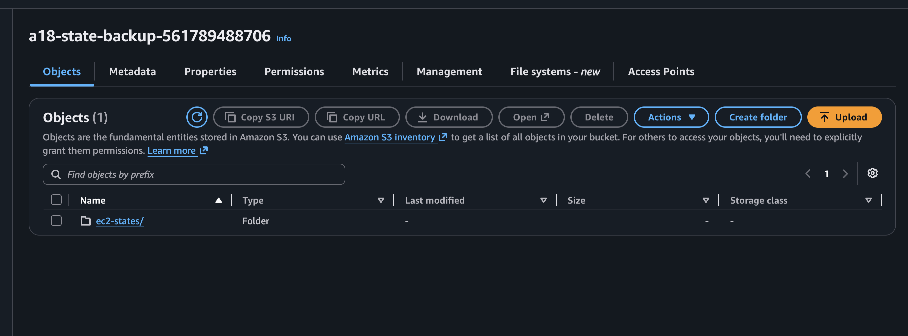

# ☁️ AWS Serverless Automation Portfolio (Lambda & Boto3)

Welcome to my advanced AWS automation portfolio. This repository showcases my proficiency in designing, deploying, and managing event-driven serverless architectures using **AWS Lambda** and the **Python Boto3 SDK**. 

## 👤 Author
- **Name:** Vraj
- **Primary AWS Region:** `ap-south-1` (Mumbai)

---

## 🎯 Project Overview

This project consists of 6 advanced AWS automation workflows. While many standard tasks involve simple CRUD operations, this portfolio was specifically curated to demonstrate complex, multi-service event orchestration. 

The implementations leverage core AWS services including **EC2, S3, DynamoDB, SNS, EventBridge, CloudWatch**, and **IAM**.

### Key Technical Achievements:
- **Event-Driven Execution:** Triggering Lambdas via DynamoDB Streams and EventBridge state changes.
- **Dynamic Resource Provisioning:** Boto3 scripts that query live AMIs and dynamically spin up/terminate EC2 instances based on load.
- **Automated Disaster Recovery:** Programmatically creating EBS snapshots, converting them to AMIs, and safely preserving state before shutdown.
- **Security & Least Privilege:** Custom IAM JSON policies attached to specific Lambda execution roles to ensure tight security boundaries.

---

## 📚 Completed Assignments Index

| Assignment | Complexity | Key Services Used | Description |
|---|---|---|---|
| [**1. Automated EC2 Management**](./assignment-01-ec2-management/) | Baseline | EC2, Lambda, IAM | Reads tags (`Auto-Start`, `Auto-Stop`) across the fleet and automatically toggles instance power states to optimize costs. |
| [**7. DynamoDB Item Change Alert**](./assignment-07-dynamodb-alert/) | Advanced | DynamoDB Streams, Lambda, SNS | Intercepts live row modifications in a NoSQL database via Streams, parses the JSON diff, and pushes alerts via SNS. |
| [**12. Auto-Scale EC2 on Load**](./assignment-12-auto-scale/) | Advanced | CloudWatch, EC2, Lambda, SNS | Simulates high traffic loads and dynamically queries for the latest Amazon Linux AMI to launch new EC2 instances automatically. |
| [**16. EC2 Disk Space Alerts**](./assignment-16-disk-space-alert/) | Advanced | CloudWatch Agent, EC2, SNS | Monitors OS-level disk utilization metrics and dispatches emergency SNS alerts when storage breaches 85%. |
| [**17. Restore EC2 from Snapshot**](./assignment-17-restore-from-snapshot/) | Advanced | EBS, EC2 (AMI), Lambda | Automates disaster recovery by translating raw EBS block snapshots into bootable Machine Images (AMIs). |
| [**18. Autosave EC2 State**](./assignment-18-autosave-ec2-state/) | Advanced | EventBridge, EC2, S3 | Uses EventBridge to intercept EC2 shutdown events milliseconds before termination, serializing and backing up the state to an S3 bucket. |

---

## 🏗️ Highlighted Architectures

### 1. Automated EC2 Management (Assignment 1)
Successfully identifying target EC2 instances and programmatically altering their power state based on Resource Tags.
 

### 2. DynamoDB Stream Intercept (Assignment 7)
Whenever an order status changes in the database, the stream triggers our Lambda which extracts the `OldImage` and `NewImage` to show exactly what changed.
 

### 3. EC2 Auto-Scaling Action (Assignment 12)
When CPU/Load breaches threshold limits, Lambda dynamically queries for the latest AMI ID and provisions immediate backup instances.
 

### 4. EC2 Disk Space Alerts (Assignment 16)
Using custom metrics logic, SNS immediately dispatches a warning when a server's simulated disk space utilization exceeds the 85% safety threshold.
 

### 5. Restore EC2 from Snapshot (Assignment 17)
Dynamically parsing EBS Snapshots to formulate valid block-device mappings, ultimately registering a brand new, bootable AMI for disaster recovery.
 

### 6. EC2 State Preservation (Assignment 18)
A critical EventBridge rule catches termination events in real-time, firing off a Lambda that dumps the EC2 JSON state directly into S3 for auditing.
 

---

## ⚙️ Setup & Deployment
Every Lambda function in this repository was deployed using the AWS CLI and follows a strict infrastructure-as-code deployment pattern. 

**Standard Deployment Pattern Used:**
1. Generate IAM Trust Policy & Custom Permission Policy.
2. Zip Python Boto3 scripts.
3. Deploy via `aws lambda create-function`.
4. Bind triggers (EventBridge, DynamoDB Event Source Mappings).

> *Detailed screenshots, IAM policies, and execution logs for every step are available inside each individual assignment's README folder.*
