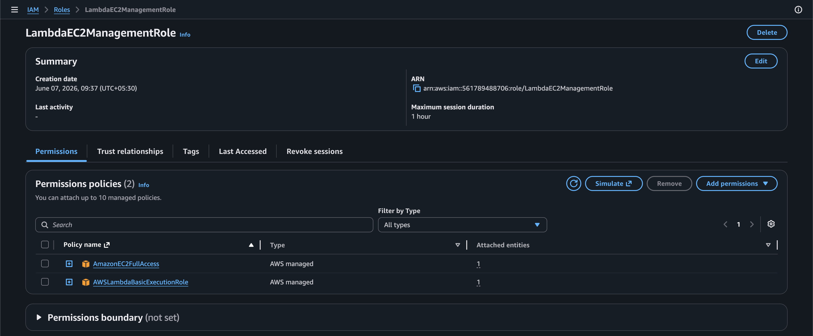
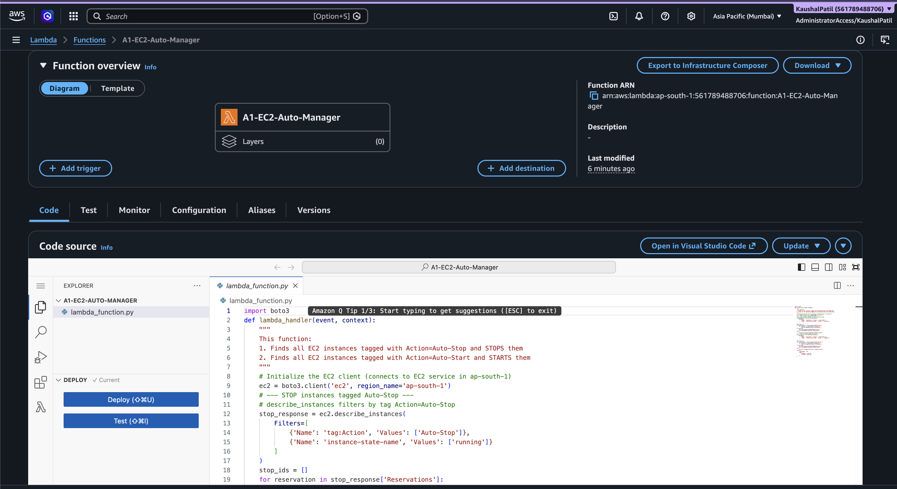

# Assignment 1: Automated Instance Management
## 🎯 Objective
Automatically manage EC2 instances based on tags to save costs. Instances tagged `Auto-Stop` are stopped, and `Auto-Start` are started.
## 🏗️ Architecture
- **AWS Lambda**: Executes the Python Boto3 script.
- **Amazon EC2**: The target resources being stopped and started.
- **IAM**: Provides permissions to describe, start, and stop instances.
## 📋 Steps Followed
1. Created two t2.micro EC2 instances in `ap-south-1`. Tagged one as `Action: Auto-Stop` and the other as `Action: Auto-Start`.
2. Created an IAM Role with `AmazonEC2FullAccess` and Lambda basic execution permissions.
3. Deployed a Boto3 Lambda function that filters instances by tag and state, and issues start/stop commands.
4. Executed the Lambda function manually to verify the state transitions.
## 💻 Code
See [lambda_function.py](./lambda_function.py)
## 📸 Screenshots
### A1_S1 - EC2 Instances Created with Tags

*Shows both instances with their respective tags.*
### A1_S2 - IAM Role Created

*Shows the IAM role with permissions attached.*
### A1_S3 - Lambda Function Created

*Shows the Lambda function successfully created in the AWS console.*
