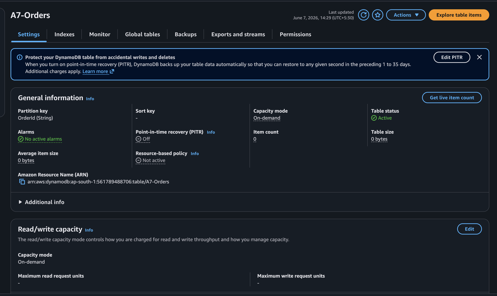

# Assignment 7: DynamoDB Item Change Alert
## 🎯 Objective
Automate alerts whenever an item in a DynamoDB table gets updated using DynamoDB Streams.
## 🏗️ Architecture
- **Amazon DynamoDB**: Source database with Streams enabled.
- **AWS Lambda**: Processes the stream records.
- **Amazon SNS**: Delivers the email alert.
## 📋 Steps Followed
1. Created `A7-Orders` DynamoDB table and enabled Streams (`NEW_AND_OLD_IMAGES`).
2. Created an IAM role granting Lambda access to DynamoDB Streams and SNS Publish.
3. Deployed the Lambda function and created an Event Source Mapping to link the Stream to Lambda.
4. Modified an item in the table via CLI, which successfully triggered the Lambda and sent an email alert.
## 💻 Code
See [lambda_function.py](./lambda_function.py)
## 📸 Screenshots
### A7_S1 - DynamoDB Table & Item

### A7_S2 - SNS Alert Email

