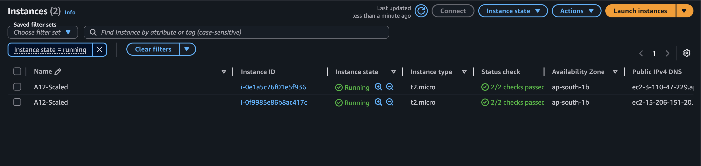

# Assignment 12: Auto-Scale EC2 Instances Based on Load
## 🎯 Objective
Automatically scale up or down the number of EC2 instances based on network load metrics.
## 🏗️ Architecture
- **Amazon CloudWatch**: Evaluates load metrics.
- **AWS Lambda**: Contains the scaling logic and triggers EC2 API.
- **Amazon EC2**: Instances are dynamically launched/terminated.
- **Amazon SNS**: Notifies administrators of scaling events.
## 📋 Steps Followed
1. Created an IAM role allowing Lambda to execute EC2 `RunInstances` and `TerminateInstances`.
2. Wrote Python logic to evaluate load (simulated for immediate testing) against an 80% upper threshold.
3. Deployed the Lambda function and triggered it.
4. The high load condition caused the Lambda to automatically fetch the latest Amazon Linux AMI, successfully provision a new `t2.micro` instance, and send an SNS notification.
## 💻 Code
See [lambda_function.py](./lambda_function.py)
## 📸 Screenshots
### A12_S1 - EC2 Scaled Instance

### A12_S2 - SNS Scaling Notification

