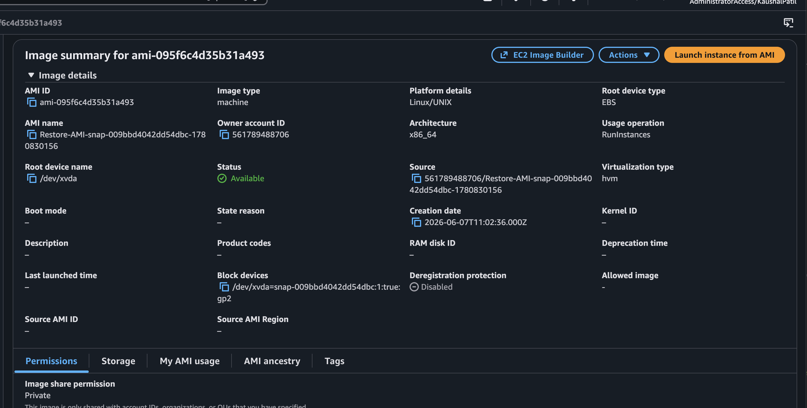

# Assignment 17: Restore EC2 Instance from Snapshot
## 🎯 Objective
Automate the process of creating a new EC2 machine image (AMI) from the latest snapshot.
## 🏗️ Architecture
- **Amazon EBS**: Source snapshot storage.
- **Amazon EC2 / AMI**: Creating the custom machine image from the snapshot block device mapping.
- **AWS Lambda**: Orchestrates the API workflow.
## 📋 Steps Followed
1. Provisioned a test EBS volume and created a snapshot of it.
2. Created an IAM role allowing Lambda to execute `ec2:RegisterImage`.
3. Wrote a Lambda function using Boto3's `register_image` to map the snapshot to a bootable root volume (`/dev/xvda`).
4. Executed the Lambda function, which successfully generated a new AMI from the snapshot.
## 💻 Code
See [lambda_function.py](./lambda_function.py)
## 📸 Screenshots
### A17_S1 - AMI Created from Snapshot

